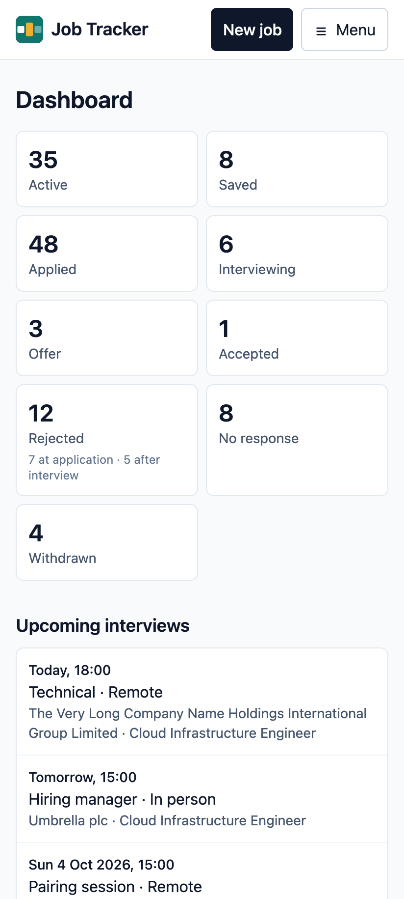

<h1 align="center">
   Job Tracker
</h1>

  
  

<strong>Track every job you apply for, from saved to offer, and see at a glance what needs following up.</strong>

A self-hostable job application tracker. Save a job in seconds, track it from "saved"
through to an offer, and let the dashboard tell you what needs following up, what's still to
apply for, and what's gone quiet. A companion Firefox extension, coming soon, will make
saving a posting a single click.

  

## What it does

- **Save jobs in seconds.** Paste a link and the source is filled in where it can be; you're warned about
  companies you've applied to before, and duplicate links are caught.
- **Track every status**, from saved to offer, with each change recorded in the job's
  history.
- **A dashboard that tells you what to do next:** jobs to follow up, applications that have
  gone quiet, and ones you've still to apply for.
- **Interviews:** upcoming, unscheduled and past, each linked to its job.
- **Find anything:** filters (including Active and Closed), search and sorting, with your
  view remembered.
- **On your phone:** a mobile layout, installable to your home screen.
- **Yours to host:** free tiers on Render and Neon, Google sign-in for the people you allow,
  each person's data private to them, and optional nightly encrypted backups.

  
  

## Get started

Everything else is in the manual, at **[job-tracker-docs.job-finder.dev](https://job-tracker-docs.job-finder.dev)**:

- **[Using Job Tracker](https://job-tracker-docs.job-finder.dev/using/getting-started/):** the dashboard, jobs, interviews, and
  installing it on your phone.
- **Self-hosting:** [deploying your own instance](https://job-tracker-docs.job-finder.dev/self-hosting/deploying/) (Render and
  Neon, with Google sign-in), [configuration](https://job-tracker-docs.job-finder.dev/self-hosting/configuration/), a
  [custom domain](https://job-tracker-docs.job-finder.dev/self-hosting/custom-domain/), and [backups](https://job-tracker-docs.job-finder.dev/self-hosting/backups/).
- **Development:** [running it locally](https://job-tracker-docs.job-finder.dev/development/local-development/) and
  [secret scanning](https://job-tracker-docs.job-finder.dev/development/secret-scanning/).
- **API:** [versions and releases](https://job-tracker-docs.job-finder.dev/api/versions-and-releases/) and
  [generating a client](https://job-tracker-docs.job-finder.dev/api/generating-a-client/).

The manual's source is in [`docs/`](docs/).

## Stack

FastAPI · SQLAlchemy (async) · PostgreSQL · React · TypeScript · Vite · Tailwind ·
Google sign-in (OIDC). One repo, one container: the backend serves the built frontend.

## Licence

The code is [AGPL-3.0-or-later](LICENSE). The logo and icons are © 2026 Luke Brewerton,
under [CC BY-NC-ND 4.0](LICENSES/CC-BY-NC-ND-4.0.txt): see
[licence and branding](https://job-tracker-docs.job-finder.dev/about/licence-and-branding/). See
[CONTRIBUTING.md](CONTRIBUTING.md) to contribute, and [SECURITY.md](SECURITY.md) to report
a vulnerability.
