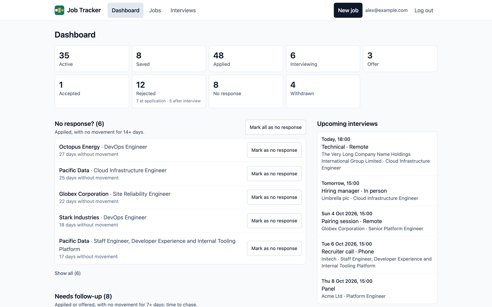

The dashboard is your starting point: what you have on, and what needs doing.

## The counts

Tiles across the top count your jobs by status: **Active** (saved, applied, interviewing
and offer), **Saved**, **Applied**, **Interviewing**, **Offer**, **Accepted**,
**Rejected**, **No response** and **Withdrawn**. Select a tile to see those jobs in the
[jobs list](/using/jobs/).

- **Applied** counts every job you've ever applied for, whatever its status now, so it
  isn't a link.
- **Rejected** shows how many were rejected at the application stage and how many after
  an interview.

## The lists

Three lists show the jobs that need something from you. A job is only ever in one of them,
and each list starts with the job that has waited longest.

"Without movement" means without a **status change**: editing a job's details doesn't
count. The thresholds below are the defaults; your instance's owner can change them.

| List | Jobs in it | What to do |
|---|---|---|
| **No response?** | Applied, with no movement for 14 days or more | Mark them as no response, or chase |
| **Needs follow-up** | Applied, with no movement for 7–13 days; or an offer with no movement for 7 days or more | Chase the recruiter |
| **Still to apply** | Saved 7 days ago or more | Apply, or remove them |

Each list shows five jobs, with **Show all** for the rest. Select a job to open it.

### Marking jobs as no response

In the **No response?** list:

- **Mark as no response** on a row marks that job. It disappears from the list straight
  away, and the counts update.
- **Mark all as no response** marks every job in the list, after asking you to confirm.

You can change any of them back from the job's page.

## Upcoming interviews

The panel lists your next five interviews, soonest first, with "Today" or "Tomorrow" for
the next two days. Select one to open its job, or **View all** for the
[interviews page](/using/interviews/).

With no jobs at all, the dashboard offers to add your first one instead.
