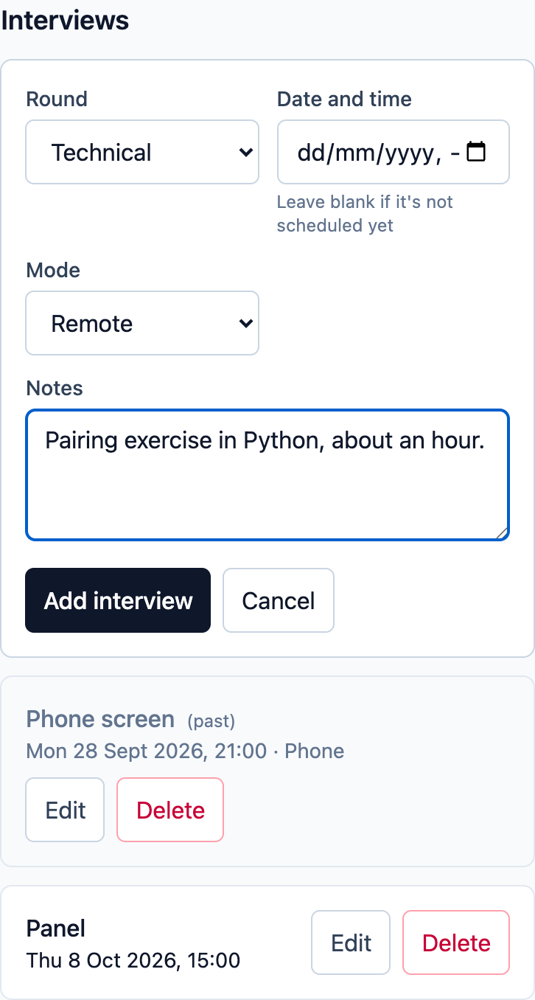
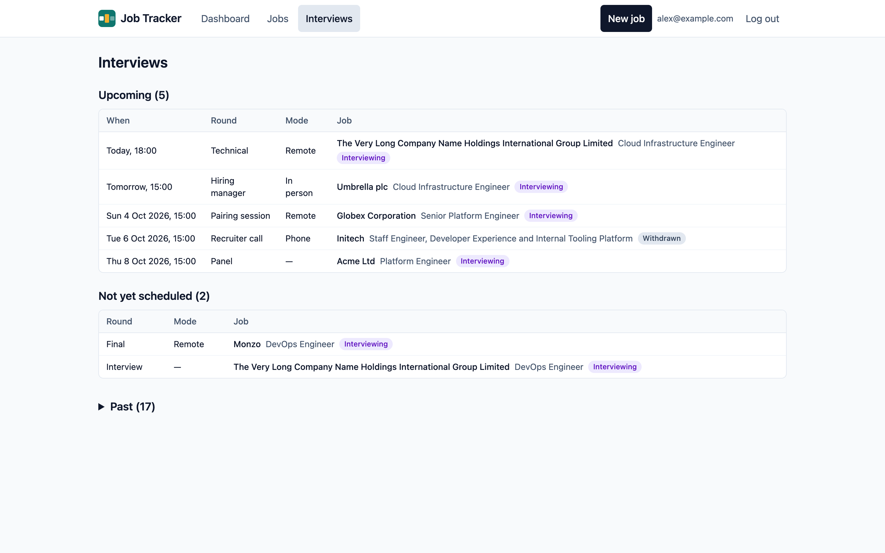

## Adding an interview

Interviews belong to a job: add them on the [job's page](/using/job-page/), under
**Interviews**, with **Add interview**. Every field is optional:

- **Round:** choose one of the usual rounds (Phone screen, Recruiter call, Technical,
  Take-home, Hiring manager, Panel, Final), or **Other…** to type your own.
- **Date and time:** leave it blank if it isn't scheduled yet. It's in your own time zone.
- **Mode:** remote, in person or phone.
- **Notes.**

After adding an interview to a job that's still **Saved** or **Applied**, Job Tracker
offers to move it to **Interviewing**.

Each interview can be edited, or deleted after confirming. Past interviews are marked.

## The interviews page

**Interviews** in the header lists every interview across your jobs, in three groups:

- **Upcoming:** soonest first, with "Today" and "Tomorrow" for the next two days.
- **Not yet scheduled:** interviews without a date, on jobs that are still active.
- **Past:** collapsed; select it to open.

Select an interview to go to its job's interviews. An interview still booked on a job
you've since closed stays under Upcoming, so you can cancel it and delete it.
