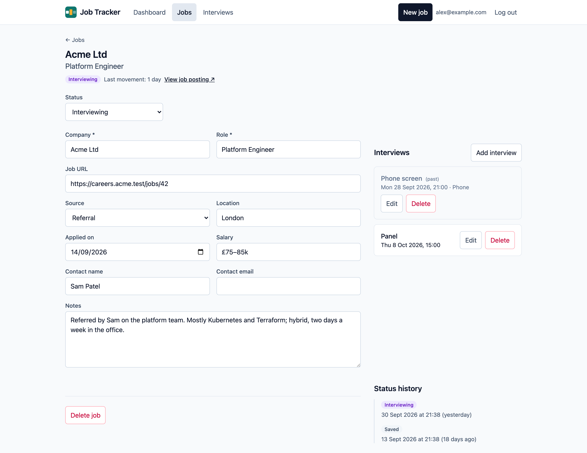

Select a job anywhere in the app to open its page. The header shows its company, role,
status and, if it needs attention, why. **View job posting** opens its link.

## Changing the status

Choose the new status from **Status**. It changes straight away, and the change is added to
the job's **status history**. A status change is what counts as "movement" on the
[dashboard](/using/dashboard/).

Moving between statuses also looks after the applied date:

- becoming **Applied** fills in today's date, if the job doesn't have one;
- an existing applied date is never overwritten;
- going back to **Saved** clears it, because a saved job hasn't been applied for.

## Editing the details

Change any of the fields, then **Save changes**, or **Discard** to put them back. If you try
to leave with unsaved changes, you're asked first. Editing details isn't movement, so it
doesn't take a job off the dashboard's lists.

## Interviews

A job's interviews are listed on its page. See [Interviews](/using/interviews/).

## Deleting a job

**Delete job** at the bottom of the page asks you to confirm, and says what goes with the
job: its status history and its interviews. Deleting can't be undone.
