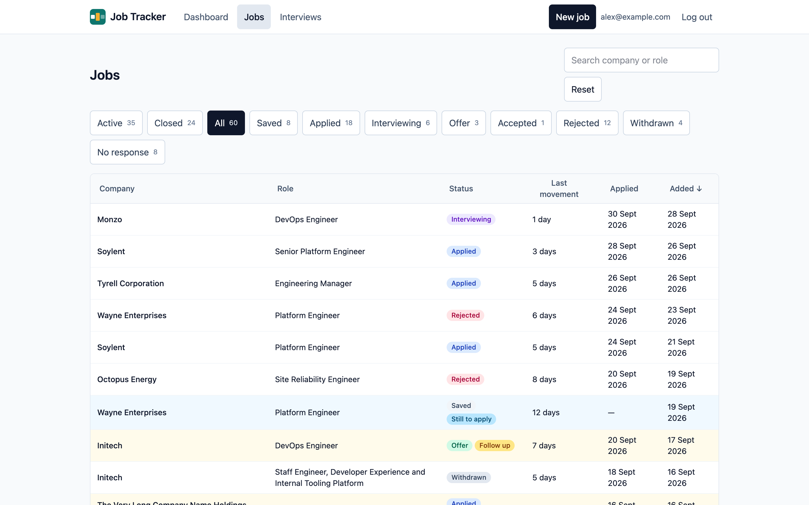

**Jobs** lists every job you've added. On a computer it's a table; on a phone, a list of
cards.

## Filters

The buttons above the list filter by status, each with its count:

- **Active:** saved, applied, interviewing and offer. This is the default.
- **Closed:** rejected, withdrawn and no response: jobs that ended without an offer being
  taken.
- **All**, and then each status on its own.

On a phone, the filters are a **Status** dropdown instead.

## Searching

Type in the search box to find jobs by company or role. It searches as you type, after a
short pause, and needs at least 2 characters.

## Sorting and paging

Select a column heading to sort by it, and select it again to reverse the order. Jobs
without an applied date always sort last. The default is newest first.

Choose 25, 50 or 100 jobs per page at the bottom of the list.

## Jobs that need attention

Jobs in one of the [dashboard's lists](/using/dashboard/#the-lists) are highlighted, with a
label saying why: **Follow up**, **Still to apply** or **No response?**.

## Your view is remembered

The filter, search, sort and page size you choose are kept in the page's address, so you
can bookmark or share a view, and also remembered by your browser: going back to **Jobs**
later shows the same view. **Reset** returns to the default.
